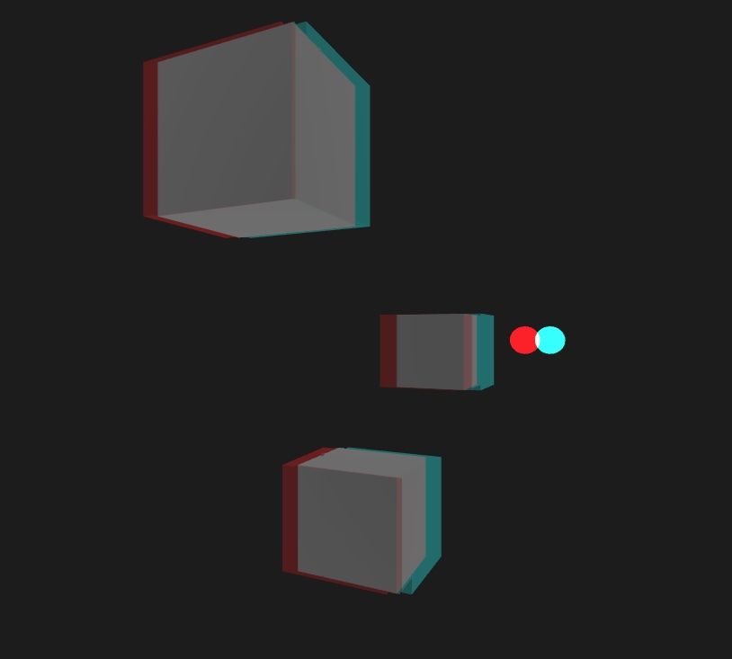

# URP Anaglyph3D
 Anaglyph 3D (red/cyan) render feature for Unity's URP

## Heads Up
This asset was created with URP 10.4.0, but it *should* work on any version of URP that has custom renderer feature and depth texture capabilities.

## Install
**RECOMMMENDED INSTALL**
Add via the Unity Package Manager
"Add package from git URL..."
`https://github.com/ryanslikesocool/URP-Anaglyph3D.git`
Add
**NOT SO RECOMMENDED INSTALL**
Download the latest version from [Releases](https://github.com/ryanslikesocool/URP-Anaglyph3D/releases).\
Open the Unity project you want the package installed in.\
Open the package to install into the project's Plugins folder.

## Usage
In your Forward Renderer asset, add the Anaglyph 3D render feature.\
- `Pass Event` leave at `Before Rendering Post Processing` for best results.
- `Anaglyph Material` assign with the `URPAnaglyph3D` material, located in `Plugins/URP Anaglyph3D/Materials` by default.

- `Channel Separation` controls the x and y offset of the effect.  Super small values (like the default `(-0.0025f, 0)`) work best.
- `Tint Opacity` controls the red/cyan tint on the entire scene.  It's purely for aesthetic and likely does not help the actual 3d effect if wearing glasses
