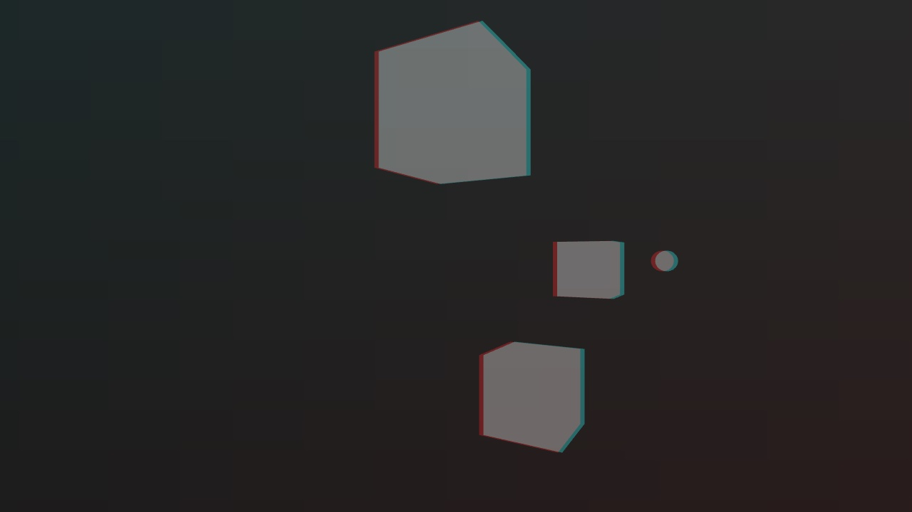

# URP Anaglyph3D
 Anaglyph 3D (red/cyan) render feature for Unity's URP

## Heads Up
This asset was created with URP 10.4.0, but it *should* work on any version of URP that has custom renderer feature and depth texture capabilities.

## Install
Download the latest version from [Releases](https://github.com/ryanslikesocool/URP-Anaglyph3D/releases).\
Open the Unity project you want the package installed in.\
Open the package to install into the project's Plugins folder.

## Usage
In your Forward Renderer asset, add the Anaglyph 3D render feature.\
In your URP asset, enable the depth texture toggle.

- `Pass Event` leave at `Before Rendering Post Processing` for best results.
- `Anaglyph Material` assign with the `URPAnaglyph3D` material, located in `Plugins/URP Anaglyph3D/Materials` by default.

- `Channel Separation` controls the x and y offset of the effect.  Values between -1 and 1 work best, since the values are in screen UVs.
- `Distance Range` controls the minimum and maximum distance range of the effect in world space.
