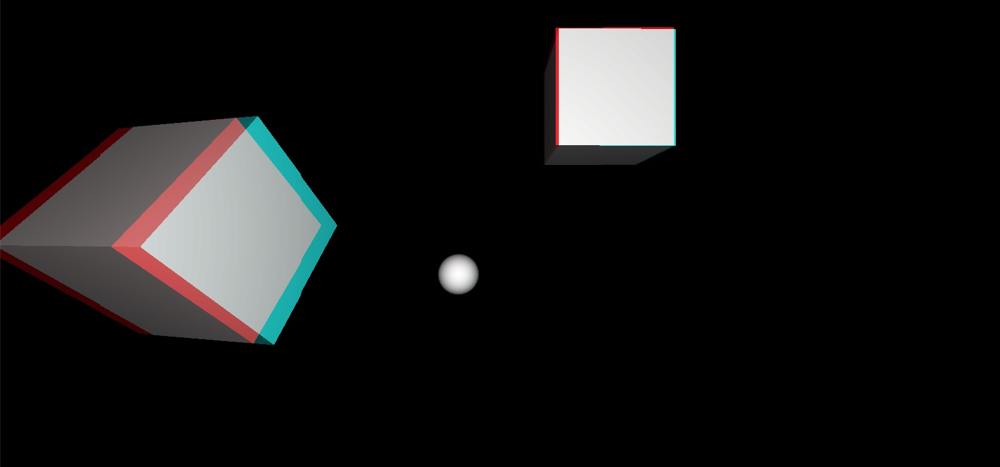

# URP Anaglyph3D
 Anaglyph 3D (red/cyan) render feature for Unity's URP

## Requirements
Anaglyph3D [v2](https://github.com/ryanslikesocool/Anaglyph3D/releases/tag/v2.1.1) requires Unity 2021.3 with URP 12.1.8 or later.\
Anaglyph3D [v3](https://github.com/ryanslikesocool/Anaglyph3D/releases/tag/v3.1.0) requires Unity 2022.1 or later with URP 13.1.7 or later.

## Install
**Recommended Installation** (Unity Package Manager)
- "Add package from git URL..."
- `https://github.com/ryanslikesocool/Anaglyph3D.git`

**Alternate Installation** (not recommended)
- Get the latest [release](https://github.com/ryanslikesocool/Anaglyph3D/releases)
- Import into your project's Plugins folder

## Usage
In your Forward Renderer asset, add the "Anaglyph Feature" render feature and change settings as desired.

| Property | Information |
| ----- | ----- |
| Render Pass Event | Leave at `Before Rendering Post Processing` for best results. |
| Layer Mask | Which layers to include when rendering the effect. |
| Spacing | The spacing between the red and cyan channels. A value of `0` will ignore the focal point.  This is useful for orthographic cameras. A negative value will swap the red and cyan. |
| Focal point | The point `x` units in front of the camera where the red and cyan channels meet. |
| Overlay Mode | `None` - Replace the background with the effect.  This is ideal for rendering the entire screen with the effect. `Opacity` - Overlay the effect based on its opacity. `Depth` - Overlay the effect based on its depth. |
| Blend Mode | `None` - Do not blend the effect onto the background. `Additive` - Perform stylistic blending by adding the effect to the background. `Channel` - Perform correct blending based on each eye's channels. |
| Shader | The anaglpyh shader, located at the root directory of the package. |
